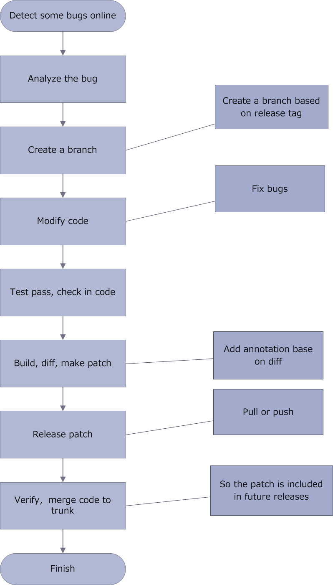

# AndFix

[ ](https://bintray.com/supern/maven/andfix/_latestVersion)
[](https://travis-ci.org/alibaba/AndFix)
[](LICENSE)

[](https://gitter.im/alibaba/AndFix?utm_source=badge&utm_medium=badge&utm_campaign=pr-badge)

AndFix is a solution to fix the bugs online instead of redistributing Android App. It is distributed as [Android Library](https://sites.google.com/a/android.com/tools/tech-docs/new-build-system/aar-format).

Andfix is an acronym for "**And**roid hot-**fix**".

AndFix supports Android version from 2.3 to 6.0, both ARM and X86 architecture, both Dalvik and ART runtime.

The compressed file format of AndFix's patch is **.apatch**. It is dispatched from your own server to client to fix your App's bugs.

## Principle

The implementation principle of AndFix is method body's replacing,


### Method replacing

AndFix judges the methods should be replaced by java custom annotation and replaces it by hooking it. AndFix has a native method `art_replaceMethod` in ART or `dalvik_replaceMethod` in Dalvik. 

For more details, [here](https://github.com/alibaba/AndFix/tree/master/jni).

## Fix Process



## Integration

### How to get?

Directly add AndFix aar to your project as compile libraries.

For your maven dependency,

	```
	<dependency>
  		<groupId>com.alipay.euler</groupId>
  		<artifactId>andfix</artifactId>
  		<version>0.4.0</version>
  		<type>aar</type>
	</dependency>
	```
For your gradle dependency,

	```
	dependencies {
   		compile 'com.alipay.euler:andfix:0.4.0@aar'
	}
	```

### How to use?

1. Initialize PatchManager,

	```
	patchManager = new PatchManager(context);
	patchManager.init(appversion);//current version
	```

2. Load patch,

	```
	patchManager.loadPatch();
	```

	You should load patch as early as possible, generally, in the initialization phase of your application(such as `Application.onCreate()`).

3. Add patch,

	```
	patchManager.addPatch(path);//path of the patch file that was downloaded
	```
	When a new patch file has been downloaded, it will become effective immediately by `addPatch`.

## Developer Tool

AndFix provides a patch-making tool called **apkpatch**.

### How to get?

The `apkpatch` tool can be found [here](https://github.com/alibaba/AndFix/raw/master/tools/apkpatch-1.0.3.zip).

### How to use?

* Prepare two android packages, one is the online package, the other one is the package after you fix bugs by coding.

* Generate `.apatch` file by providing the two package,

```
usage: apkpatch -f <new> -t <old> -o <output> -k <keystore> -p <***> -a <alias> -e <***>
 -a,--alias <alias>     keystore entry alias.
 -e,--epassword <***>   keystore entry password.
 -f,--from <loc>        new Apk file path.
 -k,--keystore <loc>    keystore path.
 -n,--name <name>       patch name.
 -o,--out <dir>         output dir.
 -p,--kpassword <***>   keystore password.
 -t,--to <loc>          old Apk file path.
```

Now you get the application savior, the patch file. Then you need to dispatch it to your client in some way, push or pull.

Sometimes, your team members may fix each other's bugs, and generate not only one `.apatch`. For this situation, you can
merge `.apatch` files using this tool,

```
usage: apkpatch -m <apatch_path...> -o <output> -k <keystore> -p <***> -a <alias> -e <***>
 -a,--alias <alias>     keystore entry alias.
 -e,--epassword <***>   keystore entry password.
 -k,--keystore <loc>    keystore path.
 -m,--merge <loc...>    path of .apatch files.
 -n,--name <name>       patch name.
 -o,--out <dir>         output dir.
 -p,--kpassword <***>   keystore password.
```

## Running sample

1. Import samplesI/AndFixDemo to your IDE, append AndFixDemo dependencies with AndFix(library project or aar).
2. Build project, save the package as 1.apk, and then install on device/emulator.
3. Modify com.euler.test.A, references com.euler.test.Fix.
4. Build project, save the package as 2.apk.
5. Use apkpatch tool to make a patch.
6. Rename the patch file to out.apatch, and then copy it to sdcard.
7. Run 1.apk and view log.

## Notice

### ProGuard

If you enable ProGuard, you must save the mapping.txt, so your new version's build can use it with ["-applymapping"](http://proguard.sourceforge.net/manual/usage.html#applymapping).

And it is necessary to keep classes as follow,

* Native method

	com.alipay.euler.andfix.AndFix

* Annotation

	com.alipay.euler.andfix.annotation.MethodReplace

To ensure that these classes can be found after running an obfuscation and static analysis tool like ProGuard, add the configuration below to your ProGuard configuration file.


	```
	-keep class * extends java.lang.annotation.Annotation
	-keepclasseswithmembernames class * {
    	native <methods>;
	}
	```

### Self-Modifying Code

If you use it, such as *Bangcle*. To generate patch file, you'd better to use raw apk.

### Security

The following is important but out of AndFix's range.

-  verify the signature of patch file
-  verify the fingerprint of optimize file

## API Documentation

The libraries javadoc can be found [here](https://rawgit.com/alibaba/AndFix/master/docs/index.html).

## Contact

...

## License

[Apache License, Version 2.0](http://www.apache.org/licenses/LICENSE-2.0.html)

Copyright (c) 2015, alipay.com
